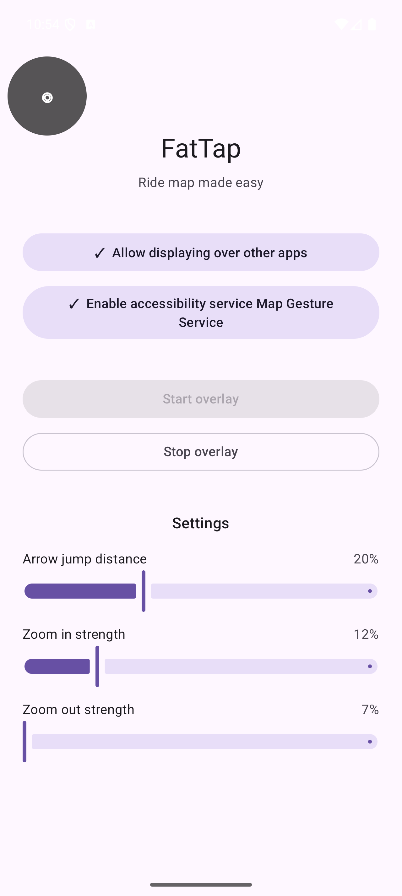
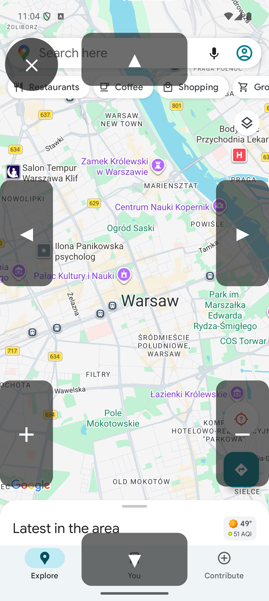
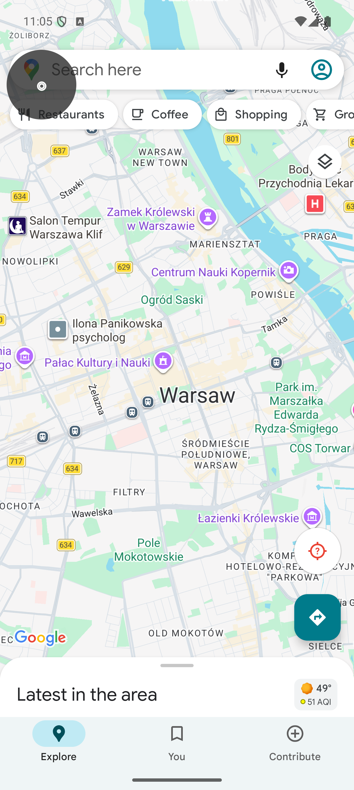

# FatTap

**Ride map made easy**

Screen overlay with large gesture buttons for controlling any map app while riding.
When your phone is mounted on handlebars and you can't precisely hit small UI elements,
FatTap gives you big, semi-transparent buttons on screen edges to swipe and zoom the map.

## Screenshot
| |                                                                                     | |
| --- |-------------------------------------------------------------------------------------| --- |
|  |  |  |

## Features

- **Directional swipe** — pan the map in any direction
- **Pinch zoom** — zoom in and out without two-finger gestures
- **Collapsible** — hide all buttons with one tap, the screen underneath stays fully interactive
- **Configurable** — adjust swipe distance and zoom strength from the setup screen
- **Lock screen ready** — overlay stays visible and interactive over the lock screen
- **Motion-friendly** — buttons respond on press, so they work even when your finger slides

## Setup

1. Grant "Display over other apps" permission
2. Enable the accessibility service
3. Tap "Start overlay"

## Privacy

FatTap does not collect, store, or transmit any personal data.
Full privacy policy: [docs/privacy-policy.html](docs/privacy-policy.html)
